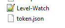
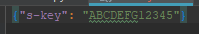
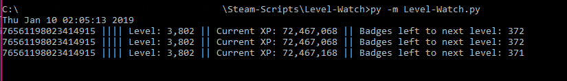

# Level-Watch.py

**Assuming you have python installed already**

* Clone into one of them fancy folders you got hidden back there.

* Open command-prompt in said folder.

* Type '*py -m pip install requests*' hit enter and let requests install.

* Navigate your way to https://steamcommunity.com/dev/apikey and gather yourself 
an API key after a long time fighting for one like the warrior you are.

* Create a *token.json* file in the same folder as *Level-Watch.py*,
paste in this huge chunk of words.

`{"s-key": "yourtokenhere"}`
 
* Don't forget to save that bad boy. it should look someting like this

 

* Now back to the command-prompt, type '*py -m Level-Watch.py*' and it should look
almost pretty.

* As long as they're leveling, something will be moving. *If it's not, They're not*

